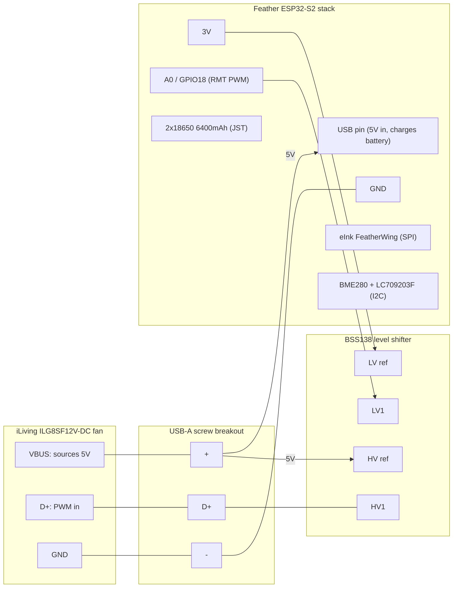

# Hardware & Wiring

Everything physical about this build, validated against the live rig on
2026-08-05 (fw 1.12.0). Enough detail to rebuild it from parts or extend it
without re-deriving anything. Protocol internals live in
[fan_protocol/PROTOCOL.md](fan_protocol/PROTOCOL.md).

## What's installed

| Part | Exact item | Notes |
|---|---|---|
| Fan | **iLiving ILG8SF12V-DC** 12" shutter exhaust fan | 12 V DC motor; ships with a wall controller; speeds 0–12 |
| Controller link | USB-A **connectors**, not USB | 5 V power + PWM on D+; see below |
| MCU | **Adafruit Feather ESP32-S2** (`featheresp32-s2`) | USB-C, onboard 1S LiPo charger |
| Display | Adafruit **2.13" mono eInk FeatherWing**, SSD1680, 250×122 | stacked on the Feather; has microSD + SRAM slots |
| Climate sensor | **BME280** (I2C `0x77`, falls back `0x76`) | temp / RH / pressure |
| Fuel gauge | **LC709203F variant** at I2C `0x0B` | IC version reads `0x2AFF`, which the Adafruit library **rejects** — firmware uses a raw I2C driver (CRC-8/ATM over the full frame, repeated-start reads mandatory) |
| Battery | **2× 18650, 3200 mAh, in parallel = 6400 mAh (1S)** | gauge APA set to `0x55` for this capacity |
| Level shifter | **BSS138 4-channel** bidirectional breakout | mandatory — the fan line peaks ~4.3 V, not 3.3 V-safe |
| Cable tap | **USB-A screw-terminal breakouts** (male into the controller/fan ports) | no soldering on the fan's own cable |

## The link is not USB

The fan and its wall controller connect with USB-A plugs carrying a
**proprietary link**: the fan **sources 5 V on VBUS** (it powers the wall
controller), and speed is commanded as **PWM on the D+ pin** — period
**9934 µs (~100.7 Hz)**, 13-entry duty table, ~4.3 V peak. D− idles high and
carries nothing. Full decode, captures, and the measured table:
[fan_protocol/PROTOCOL.md](fan_protocol/PROTOCOL.md).

### ⚠️ Iron laws (each one learned the hard way)

1. **Never plug the fan's cable into a computer or hub.** The fan drives 5 V
   *out* on VBUS; a Mac hub logged 127 overcurrent events before we understood.
2. **Never two 5 V sources at once.** The fan's VBUS feeds the Feather's USB
   pin — unhook it before connecting USB-C to a computer, or the rails fight.
3. **The fan's 5 V alone cannot power the Feather** — it browns out in a
   0→1→0 boot loop. The battery is not optional; it buffers the weak rail and
   the fan's 5 V trickle-charges it (observed ~+66 mV/h, 29%→54% in a day).
4. **The PWM pin stays RMT-owned forever.** `rmtDeinit()` parks the line at
   its last level, which the fan interprets as a speed. "Off" is a flat wave
   transmitted by RMT, not a released pin.

## System diagram



## Wire-by-wire

Common ground everywhere: fan `−` ↔ breakout `−` ↔ shifter GND (both sides) ↔
Feather GND.

### Feather → shifter (LV, 3.3 V side)

| Feather pin | Shifter pin | Purpose |
|---|---|---|
| `3V` | `LV` | 3.3 V reference for the low side |
| `GND` | `GND` | common ground |
| `A0` (GPIO 18) | `LV1` | **the fan PWM**, driven by the RMT peripheral |
| `A1` (GPIO 17) | `LV2` | spare; idles HIGH to mimic the real link's idle D− |

### Fan cable → breakout → shifter (HV, ~5 V side)

| Fan wire (breakout terminal) | Goes to | Purpose |
|---|---|---|
| `+` (VBUS — **fan sources 5 V**) | shifter `HV` **and** Feather `USB` pin | HV reference + charges the battery |
| `D+` | shifter `HV1` | the only signal wire |
| `D−` | shifter `HV2` (optional) | unused by the fan; held high via LV2 |
| `−` | common GND | |

### On-stack peripherals (no external wiring)

| Signal | GPIO | Device |
|---|---|---|
| EPD CS | 9 | eInk FeatherWing (SSD1680; busy/reset not wired — library uses timed waits) |
| EPD DC | 10 | eInk FeatherWing |
| SD CS | 5 | FeatherWing microSD slot |
| SRAM CS | 6 | FeatherWing SRAM |
| I2C SDA/SCL | default | BME280 (`0x77`/`0x76`), LC709203F (`0x0B`) |

Text version of the signal path:

```
Fan cable        USB-A breakout      BSS138 shifter          Feather ESP32-S2
=========        ==============      ==============          ================
 VBUS 5V  ────────  +  ──┬─────────── HV (ref)
                         └─────────────────────────────────── USB pin (charge in)
 D+  ─────────────  D+ ────────────── HV1 ◄──► LV1 ────────── A0 / GPIO18 (RMT)
 D-  ─────────────  D- ────────────── HV2 ◄──► LV2 ────────── A1 / GPIO17 (idle HIGH)
 GND ─────────────  -  ──┬─────────── GND (both sides)
                         └─────────────────────────────────── GND
                                      LV (ref) ◄───────────── 3V
                                                              JST ── 2x18650 (1S, 6400 mAh)
```

## The polarity gotcha (read before changing the duty table)

The wall controller's output measures **active-low** (fan power = LOW
fraction, off = flat HIGH) — that's what PROTOCOL.md documents. But driven
through this rig, **the fan follows the HIGH fraction**: our first deploy
used the controller's polarity verbatim and "off" ran the fan at full blast.
The firmware's `kHighUs[13]` table is therefore the **mirror** of the
captured table, and **off = solid LOW**. Verified across all 13 settings on
the live fan. If a future rig behaves differently, `GET /api/raw?us=N`
transmits an arbitrary HIGH-width for empirical recalibration without
reflashing.

## Power architecture

- The fan's 5 V export → Feather `USB` pin → onboard charger → battery.
  The battery carries all load spikes (WiFi TX) the weak rail can't.
- Deployed configuration: **fan 5 V + battery**. The board runs
  `WiFi.setSleep(false)` for a responsive UI, which kills a lone battery in
  about a day — don't deploy battery-only.
- Bench configuration: **USB-C from computer + battery, fan VBUS
  disconnected** (iron law #2).

## Reproducing the decode (if a new fan/firmware revision appears)

1. Power the wall controller from a bench 5 V USB source into its **fan 1**
   port (the controller runs its full UI with no fan attached).
2. Male USB-A screw breakout in **fan 2**; logic analyzer (24 MHz fx2lafw,
   sigrok/PulseView) GND→`−`, CH1→`D+`, CH2→`D−`, CH3→`+`; 1 MHz sampling.
3. Step the controller 0→12, capture ~1 s per setting
   (`docs/fan_protocol/captures/`, decoded by `analyze.py`).
4. **Rehearse before fan contact**: transmit the table from the ESP32 into
   the analyzer (`feather_esp32s2_fan_rehearsal` env) and diff against the
   captures. Our rehearsal matched all 12 widths with 0 µs error.
5. Only then wire the fan, and expect to re-check polarity (see gotcha).

## Bench/decode shopping list (~$53 total, 2026-08-02)

- Zovfam USB-A screw-terminal breakout (4-pack, male + female)
- HiLetgo 24 MHz 8-ch logic analyzer (fx2lafw-compatible, PulseView/sigrok)
- Goupchn test hook clips
- BSS138 4-channel level shifter breakouts
- ELEGOO dupont jumper set

## Firmware/service quick reference

| Thing | Value |
|---|---|
| Build env | `feather_esp32s2_fan_controller` (PlatformIO, Arduino core) |
| PWM engine | ESP32 RMT: `rmtInit(18, RMT_TX_MODE, RMT_MEM_NUM_BLOCKS_1, 1000000)` + `rmtWriteLooping` — keeps transmitting through flash writes and reboots of the main loop |
| Web UI / API | `http://garage-fan.local/` (port 80), SSE live-push on port 8081 |
| MQTT | broker `10.27.27.27:1883` (Home Assistant box) — `garage/fan/set·state·availability`, `garage/climate` |
| OTA | `POST /update?token=…` → inactive A/B slot (2×1408 K + TinyUF2 factory); image confirms on first broker connect, 3 broker-less boots auto-roll back |
| Serial gotcha | ESP32-S2 USB-CDC drops output with no DTR listener — a "silent" board is usually fine; check `garage-fan.local`/ARP instead |
| Credentials | WiFi/MQTT come from a gitignored `.env` at repo root → `generated_config.h` (a fresh clone builds with empty creds — fill `.env` first) |
